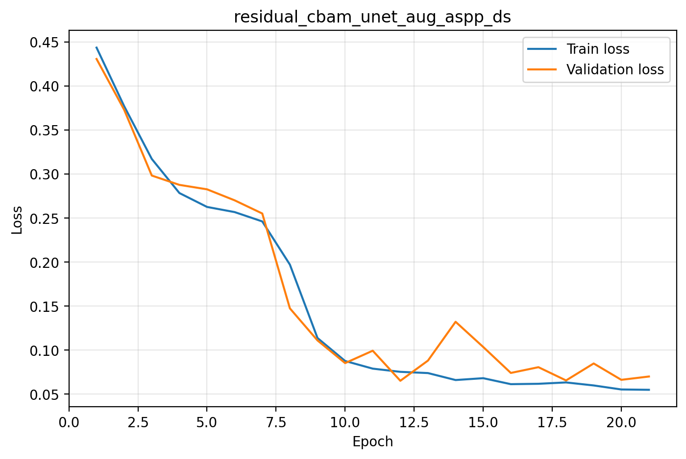
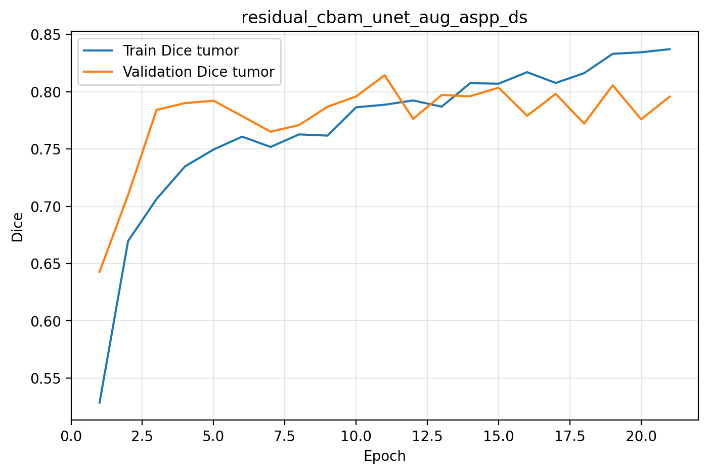
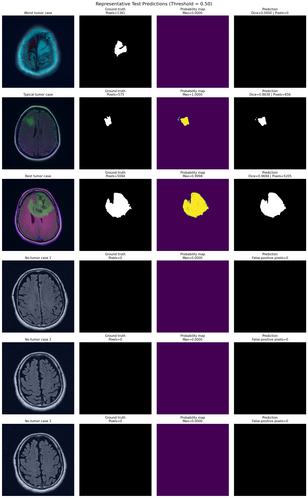
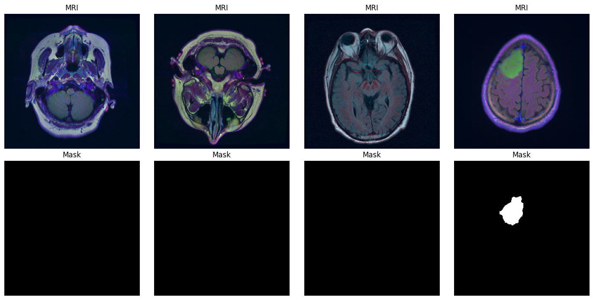
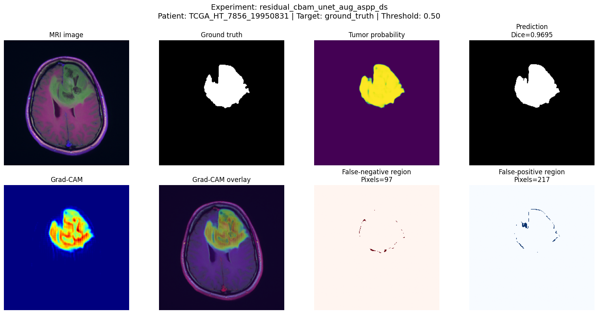

# Brain Tumor MRI Segmentation with Configurable Residual CBAM U-Net

A PyTorch-based experimental framework for binary brain tumor segmentation from MRI images using a configurable U-Net architecture with Residual blocks, CBAM attention, ASPP, and deep supervision.

The project focuses not only on segmentation accuracy, but also on controlled architecture ablations, recall-oriented optimization, patient-level data splitting, detailed error analysis, and model interpretability with Grad-CAM.

---

## Project Overview

This project investigates different U-Net configurations for brain tumor segmentation.

The architecture can independently enable or disable:

- Residual blocks
- CBAM attention
- ASPP
- Deep supervision
- Data augmentation

This makes it possible to perform controlled ablation experiments and evaluate the contribution of each component.

The project also compares Dice-Focal loss with a recall-oriented Dice-Focal-Tversky loss.

---

## Dataset

The project uses the LGG MRI Segmentation dataset originally distributed through Kaggle.

The dataset contains brain MRI slices together with binary tumor segmentation masks.

To reduce data leakage, the dataset is divided at the **patient level** rather than randomly splitting individual MRI slices.

Default split:

- 80% training
- 10% validation
- 10% testing

The dataset itself is not included in this repository.

---

## Key Features

### Data Pipeline

- Patient-level train/validation/test splitting
- Automatic MRI and mask pairing
- Tumor-area analysis
- Tumor-size categorization
- Albumentations-based data augmentation
- Weighted sampling with additional emphasis on small and medium tumors
- Leakage checks between dataset splits

### Model Architecture

- Configurable U-Net
- Standard or Residual convolution blocks
- CBAM channel and spatial attention
- Atrous Spatial Pyramid Pooling (ASPP)
- Encoder-decoder skip connections
- Optional deep supervision

### Training

- AdamW optimizer
- Automatic mixed precision
- Gradient clipping
- ReduceLROnPlateau learning-rate scheduler
- Early stopping
- Best-model checkpointing
- Reproducible random seeds

### Loss Functions

- Dice Loss
- Focal Loss
- Tversky Loss
- Dice + Focal
- Dice + Focal + Tversky

The Tversky configuration places greater emphasis on false-negative tumor pixels to support recall-oriented segmentation.

### Evaluation

The evaluation pipeline reports:

- Dice score
- IoU
- Precision
- Recall
- Specificity
- Tumor-image Dice
- Empty-mask Dice
- False-positive rate on tumor-free images

Additional evaluation includes:

- Validation threshold optimization
- Multi-seed experiments
- Mean ± standard deviation reporting
- Sample-level error analysis
- Completely missed tumor analysis
- False-positive and false-negative analysis

### Explainability

The project includes a segmentation-specific Grad-CAM implementation.

Grad-CAM is applied to multi-channel decoder feature maps to visualize which spatial regions contribute to tumor predictions.

The analysis can display:

- MRI image
- Ground-truth mask
- Tumor probability map
- Binary prediction
- Grad-CAM heatmap
- Grad-CAM overlay
- False-negative regions
- False-positive regions

---

## Repository Structure

```text
brain-tumor-segmentation/
│
├── notebooks/
│   └── brain_tumor_segmentation.ipynb
│
├── src/
│   ├── __init__.py
│   ├── config.py
│   ├── data.py
│   ├── model.py
│   ├── training.py
│   ├── experiments.py
│   └── evaluation.py
│
├── results/
│
├── requirements.txt
├── .gitignore
└── README.md
```

## Architecture Experiments

The main ablation study compares the following configurations:

| Configuration | Residual | CBAM | Augmentation | ASPP | Deep Supervision |
|---|---:|---:|---:|---:|---:|
| U-Net | No | No | No | Yes | Yes |
| U-Net + Augmentation | No | No | Yes | Yes | Yes |
| Residual U-Net | Yes | No | No | Yes | Yes |
| Residual U-Net + Augmentation | Yes | No | Yes | Yes | Yes |
| CBAM U-Net | No | Yes | No | Yes | Yes |
| CBAM U-Net + Augmentation | No | Yes | Yes | Yes | Yes |
| Residual CBAM U-Net | Yes | Yes | No | Yes | Yes |
| Residual CBAM U-Net + Augmentation | Yes | Yes | Yes | Yes | Yes |

After selecting the strongest main architecture, a secondary ablation evaluates the effect of:

- ASPP disabled + Deep Supervision disabled
- ASPP only
- Deep Supervision only
- ASPP + Deep Supervision 

---

## Results

### Final Test Performance

| Metric | Value |
|---|---:|
| Tumor Dice | 0.8103 |
| Tumor IoU | 0.7163 |
| Tumor Precision | 0.8260 |
| Tumor Recall | 0.8628 |
| Specificity | 0.9951 |
| Median Tumor Dice | 0.8831 |
| Missed Tumor Rate | 2.34% |

### Dataset Split

| Split | Patients | Images | Tumor Images | Tumor Image % |
|---|---:|---:|---:|---:|
| Train | 88 | 3165 | 1092 | 34.50 |
| Validation | 11 | 409 | 153 | 37.41 |
| Test | 11 | 355 | 128 | 36.06 |

The dataset was split at the patient level to prevent patient leakage between training, validation, and test sets.

### ASPP and Deep Supervision Ablation

| Configuration | Tumor Dice | Tumor IoU |
|---|---:|---:|
| ASPP + Deep Supervision | **0.8103** | **0.7163** |
| Deep Supervision only | 0.8058 | 0.7121 |
| No ASPP / No Deep Supervision | 0.8014 | 0.7036 |
| ASPP only | 0.7938 | 0.6987 |

### Training Dynamics

Training and validation loss:



Training and validation tumor Dice:



### Representative Predictions

Representative test cases including difficult, typical, successful, and no-tumor examples:



### Dataset Examples

Example MRI slices and corresponding segmentation masks:



### Grad-CAM Explainability

Grad-CAM visualization for a successfully segmented tumor case:




## Installation

Install the required Python packages with:

```bash
pip install -r requirements.txt
```

The main dependencies are:

- PyTorch
- NumPy
- Pandas
- OpenCV
- Matplotlib
- scikit-learn
- Albumentations
- tqdm

---

## Notebook

The complete experimental workflow is available in:

```text
notebooks/brain_tumor_segmentation.ipynb
```

The notebook contains the full end-to-end workflow, including:

- Dataset preparation
- Patient-level splitting
- Data augmentation
- Model definition
- Training
- Architecture ablation experiments
- Threshold optimization
- Error analysis
- Grad-CAM visualization

The `src/` directory contains the same main components in a cleaner modular structure for easier reuse and maintenance.

---

## Results

The project produces quantitative and qualitative outputs for comparing different segmentation configurations.

The evaluation includes:

- Tumor Dice score
- IoU
- Precision
- Recall
- Specificity
- False-positive rate on tumor-free images
- Completely missed tumor analysis
- Threshold optimization
- Multi-seed evaluation
- Grad-CAM visualizations

Selected result tables and figures will be placed in the `results/` directory.

Examples of planned repository outputs include:

- Architecture comparison table
- Training curves
- Representative segmentation predictions
- Error-analysis examples
- Grad-CAM visualizations

---

## Project Scope

This repository is intended as an experimental computer vision and medical image segmentation project.

It demonstrates:

- Deep learning model development
- Configurable neural network architecture design
- Controlled ablation studies
- Patient-level data splitting
- Segmentation evaluation
- Reproducible experimentation
- Error analysis
- Threshold optimization
- Model interpretability with Grad-CAM

This project is intended for research and portfolio purposes and is not intended for clinical use.---

## Project Scope

This repository is intended as an experimental computer vision and medical image segmentation project.

It demonstrates:

- Deep learning model development
- Configurable neural network architecture design
- Controlled ablation studies
- Patient-level data splitting
- Segmentation evaluation
- Reproducible experimentation
- Error analysis
- Threshold optimization
- Model interpretability with Grad-CAM

This project is intended for research and portfolio purposes and is not intended for clinical use.